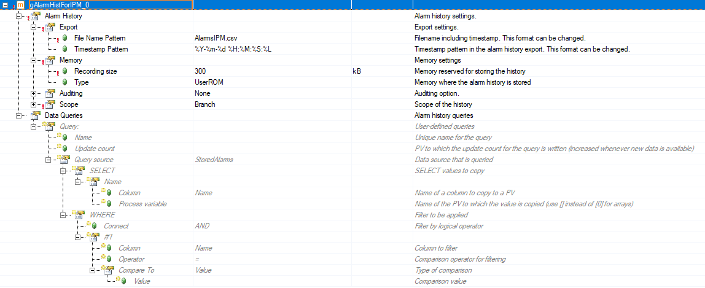
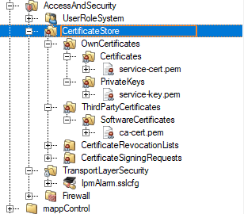
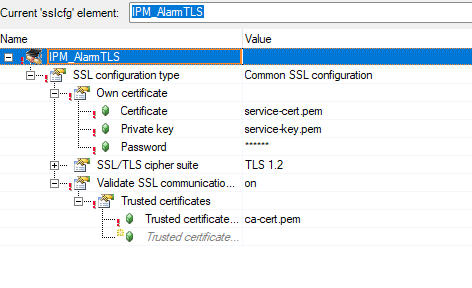
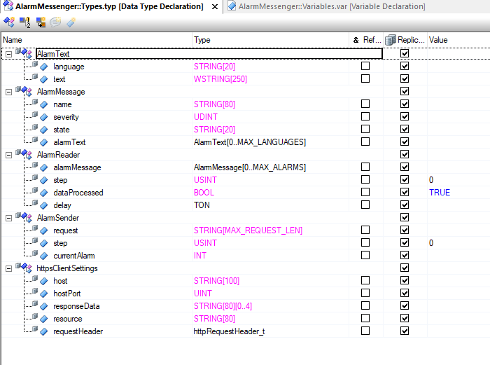
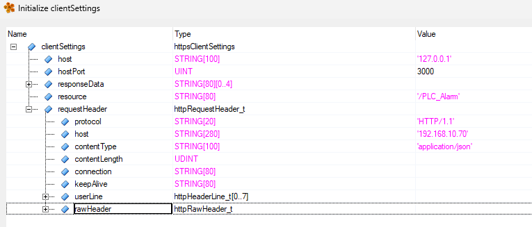
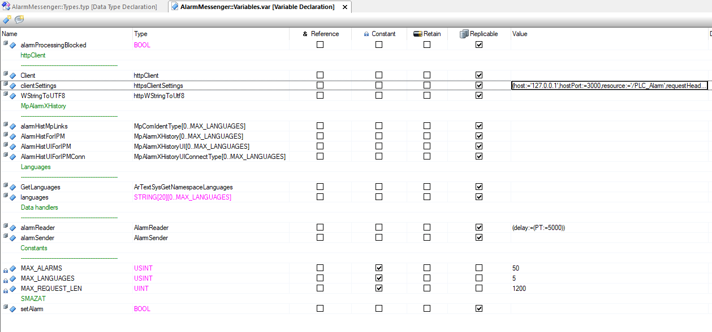

# Alarm sending from PLC to IPM

## Description
The main idea of the alarm reader is that we use one general structure for collecting alarms in different language versions and sending them to an HTTPS server. These alarms are stored in a unified format, eliminating the need for custom programming to adjust the core functionality.

## Implemetation
- The source codes are available for download at the end of the documentation.
### Configuration View
- Add the configuration file **.mpAlarmXHistory** to the project.
- Ensure the number of elements in this configuration matches the **maximum number of languages** used in the program variables.

	

- The settings for all elements should be the same as shown in the image below:

	

- Insert the program into **CPU.sw**, to the same **Cyclic** as **AlarmCore**.

	

- Create an SSL configuration and add certificates to the connection.

	
	

### Logical view
 - Copy the program into the **Logical View** of the project.

	

## Description of the data types and variables
### Data types
**AlarmText**
- Stores the alarm message in multiple languages.
- Includes a language code and a localized alarm message.

**AlarmMessage**
- Represents a single alarm with metadata.
- Defines the alarm name, severity level, state, and multilingual descriptions.

**AlarmReader**
- Reads and processes alarms.
- Manages the alarm processing steps and includes a timer for handling delays.

**AlarmSender**
- Prepares and sends alarm messages over HTTP.
- Handles the request structure and keeps track of the current alarm being transmitted.

**httpsClientSettings**
- Configures HTTPS client settings.
- Defines server details, API endpoint, and response handling.



### Variables
**alarmProcessingBlocked**
- Indicates whether alarm processing is currently blocked.
- By default, sending is blocked after the PLC starts until the first acknowledgment is pressed.

**SslOpen**
- Loads SSL configuration ident.

**sslIdent**
- Stores ssl ident

**Client**
- Defines the HTTPS client instance with server settings, including host, port, and resource.

**clientSettings**
- Stores the configuration settings for the HTTPS client.



**WStringToUTF8**
- Converts WString data to UTF-8 encoding for proper text transmission.

**MpAlarmXHistory**
- Stores alarm history data.

**alarmHistMpLinks**
- Links alarm history to multiple language configurations.
  
**AlarmHistUIForIPM**
- Manages alarm history for user interface display in IPM.

**AlarmHistUIForIPMConn**
- Stores connection-related alarm history for the IPM user interface.

**GetLanguages**
- Retrieves available language settings.

**languages**
- Stores a list of available language codes.

**alarmReader**
- Reads and processes alarm data.

**alarmSender**
- Prepares and transmits alarm messages via HTTP.

**MAX_ALARMS**
- Defines the maximum number of alarms that can be processed.
- The value is determined by the maximum number of records in AlarmHistUIForIPMConn.

**MAX_LANGUAGES**
- Specifies the maximum number of supported languages.

**MAX_REQUEST_LEN**
- Determines the maximum request length for HTTP communication.



## Description of the source code
### Init
- The target languages are loaded from the **IAT** namespace.  

??? example "Loading of used languages"
	``` c
	GetLanguages.First = true;
	GetLanguages.Namespace = (UDINT) "IAT";

	for(int i = 0; i < MAX_LANGUAGES; i++)
	{
		GetLanguages.Execute = true;
		ArTextSysGetNamespaceLanguages(&GetLanguages);

		brsstrcpy((UDINT) languages[i], (UDINT) GetLanguages.LanguageCode);

		GetLanguages.Execute = false;
		GetLanguages.First = false;

		ArTextSysGetNamespaceLanguages(&GetLanguages);
		if (GetLanguages.EndOfList) break; // Exit loop if the last language is reached
	}
	```

- The variable **alarmHistMpLinks** is assigned individual **MpLink** values from the **Configuration View**.  

??? example "Saving MpLinks"
	``` c
		alarmHistMpLinks[0] = gAlarmHistForIPM_0;
		alarmHistMpLinks[1] = gAlarmHistForIPM_1;
		alarmHistMpLinks[2] = gAlarmHistForIPM_2;
		alarmHistMpLinks[3] = gAlarmHistForIPM_3;
		alarmHistMpLinks[4] = gAlarmHistForIPM_4;
	```

- All **MpAlarmXHistory** and **MpAlarmXHistory UI** components are configured and started.  

??? example "Components configuring"
	``` c
		for (int i = 0; i < MAX_LANGUAGES; i++)
		{
			AlarmHistForIPM[i].Enable = true;
			AlarmHistForIPM[i].ErrorReset = GlobalAck;
			AlarmHistForIPM[i].MpLink = (UDINT) &alarmHistMpLinks[i];
			MpAlarmXHistory(&AlarmHistForIPM[i]);
		
			AlarmHistUIForIPM[i].Enable = true;
			AlarmHistUIForIPM[i].ErrorReset = GlobalAck;
			AlarmHistUIForIPM[i].MpLink = (UDINT) &alarmHistMpLinks[i];
			brsstrcpy((UDINT) AlarmHistUIForIPMConn[i].Language, (UDINT) languages[i]);
			AlarmHistUIForIPM[i].UIConnect = &AlarmHistUIForIPMConn[i];
			MpAlarmXHistoryUI(&AlarmHistUIForIPM[i]);
		}	
	```

- Get the **sslIdent**
??? example "Getting sslIdent"
	``` c
		SslOpen.Execute = true;
		brsstrcpy((UDINT) SslOpen.Name, (UDINT) "IPM_AlarmTLS");
		ArSslOpen(&SslOpen);
		sslIdent = SslOpen.Ident;
	```

- The **httpsClient** settings are initialized.  

??? example "Setting httpClient"
	``` c
		Client.method 			= httpMETHOD_POST;
		Client.option 			= httpOPTION_HTTP_11;
		Client.sslCfgIdent		= sslIdent;
		Client.pHost 			= &clientSettings.host;
		Client.hostPort			= clientSettings.hostPort;
		Client.pUri 			= &clientSettings.resource;
		Client.pResponseData 	= &clientSettings.responseData;
		Client.responseDataSize = sizeof(clientSettings.responseData);
		Client.pRequestData		= &alarmSender.request;
		Client.pRequestHeader   = &clientSettings.requestHeader;
	```

- Alarm processing blocked is enabled.

??? example "Alarm processing blocked"
	``` c
		alarmProcessingBlocked  = true;
	```


### Cyclic
- First, the program checks whether the acknowledgment button has already been pressed.  
- If not, the program terminates.  
- If the acknowledgment flag is still set and the button is pressed, the flag is cleared, and the current alarm history is deleted. 

??? example "Alarm processing blocked"
	``` c
		if (alarmProcessingBlocked && GlobalAck)
		{
			alarmProcessingBlocked = false;
			ClearAlarmHistory();
		}
		if (alarmProcessingBlocked) return;
	```


The program consists of two step-based state machines:  
1. One for reading alarms in different languages and storing them in the required structure. 

??? example "Alarm reader"
	``` c
		switch (alarmReader.step)
		{
			case 0:
				alarmReader.delay.IN = false;
				if (brsstrcmp((UDINT) AlarmHistUIForIPMConn[0].AlarmList.Name[0], (UDINT) "") && alarmReader.dataProcessed) 
				{
					ResetAlarmMesages(alarmReader.alarmMessage);
					alarmReader.step = 1;
				}
				break;
			
			case 1:
				alarmReader.delay.IN = true;
				if (alarmReader.delay.Q)
				{
					alarmReader.delay.IN = false;
					alarmReader.step = 2;
				}
				break;
			
			case 2:
				for (int i = 0; i < MAX_ALARMS; i++)
				{
					if (!brsstrcmp((UDINT) AlarmHistUIForIPMConn[0].AlarmList.Message[i], (UDINT) "")) break;
					brsstrcpy((UDINT) alarmReader.alarmMessage[i].name,(UDINT) AlarmHistUIForIPMConn[0].AlarmList.Name[i]);
					alarmReader.alarmMessage[i].severity = AlarmHistUIForIPMConn[0].AlarmList.Severity[i];
					brsstrcpy((UDINT) alarmReader.alarmMessage[i].state, (UDINT) GetAlarmState(AlarmHistUIForIPMConn[0].AlarmList.NewState[i]));
					for (int j = 0; j < MAX_LANGUAGES; j++)
					{
						if (!brsstrcmp((UDINT) languages[j], (UDINT) "")) break;
						brsstrcpy((UDINT) alarmReader.alarmMessage[i].alarmText[j].language,(UDINT) AlarmHistUIForIPMConn[j].Language);
						brsmemcpy((UDINT) alarmReader.alarmMessage[i].alarmText[j].text,(UDINT) AlarmHistUIForIPMConn[j].AlarmList.Message[i], sizeof(AlarmHistUIForIPMConn[j].AlarmList.Message[i]));
					}
				}
				alarmReader.step = 3;
				break;
				
			case 3:
				ClearAlarmHistory();
				alarmReader.dataProcessed = false;
				alarmReader.step = 0;
				break;		
		}
		TON(&alarmReader.delay);
		for (int i = 0; i < MAX_LANGUAGES; i++) MpAlarmXHistoryUI(&AlarmHistUIForIPM[i]);
	```

2. Another for creating JSON data from this structure and sending alarms to the HTTP server.  

??? example "Alarm sender"
	``` c 
		switch (alarmSender.step)
		{
			case 0:
				alarmSender.currentAlarm = MAX_ALARMS;
				Client.enable = false;
				if ((alarmReader.step == 0) && !alarmReader.dataProcessed)
				{
					Client.enable = true;
					alarmSender.step = 1;
				}
				break;
			
			case 1:
				for (alarmSender.currentAlarm = MAX_ALARMS; alarmSender.currentAlarm >= 0; alarmSender.currentAlarm--)
				{
					if (brsstrcmp((UDINT) alarmReader.alarmMessage[alarmSender.currentAlarm].name, (UDINT) "")) break;
				}
				
				if (alarmSender.currentAlarm <= 0)
				{
					alarmReader.dataProcessed = true;
					alarmSender.step = 0;
				}else
				{
					alarmSender.step = 2;
				}
				break;
			
			case 2:
				GenerateAlarmJson(alarmSender.request, &alarmReader.alarmMessage[alarmSender.currentAlarm--]);
				Client.requestDataLen = brsstrlen((UDINT) alarmSender.request);
				clientSettings.requestHeader.contentLength = brsstrlen((UDINT) alarmSender.request);
				Client.send = true;
				alarmSender.step = 3;
				break;
			
			case 3:
				if (Client.httpStatus = 200)
				{
					Client.send = false;
					if (alarmSender.currentAlarm < 0)
					{
						alarmReader.dataProcessed = true;
						alarmSender.step = 0;
					}else
					{
						alarmSender.step = 2;
					}
				}
				break;
		}
		httpClient(&Client);
	```

### Exit
- All components are properly terminated.  
- The HTTP client is stopped.  

## Output JSON Data
```json
{
  "alarmMessage": {
    "Name": "RobExt",
    "Severity": 20,
    "State": "ACTIVE",
    "AlarmTexts": [
      {
        "Language": "cs-CZ",
        "Text": "Robot není v EXT režimu!"
      },
      {
        "Language": "de",
        "Text": "Der Roboter ist nicht im EXT-Modus!"
      },
      {
        "Language": "en",
        "Text": "The robot is not in EXT mode!"
      }
    ]
  }
}
```

## Testing
- To test alarm sending, you can use the **Mockoon** software: 
https://mockoon.com/download/

## Project-Specific Adjustments
### Change the Server IP Address (or port) for Sending Alarms
- To change the server IP address, we need to update the **clientSettings.host** and **clientSettings.requestHeader.host** variables.
- To change the server port, we need to update the **clientSettings.hostPort**.

### Changing the Number of Languages
1. Add Additional Elements in **.mpAlarmXHistory**
2. Change the Variable **MAX_LANGUAGES**
3. Connect New Elements to **alarmHistMpLinks** in the **INIT** Section

### Change of Certificates
- We will request the cellInterfaceService certificates for the current project from the IPM team.
- Then, we will replace the existing certificates in the template with the updated ones.

## Source code
Complete source code for download (After clicking, it takes a moment before the download starts):
[AlarmMessenger](sources/AlarmMessenger.zip)